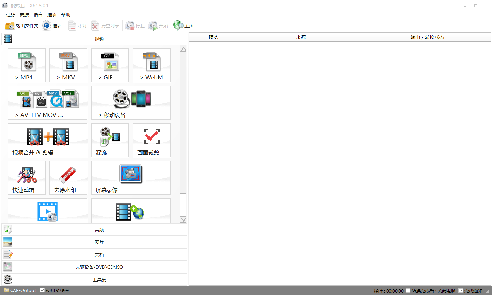
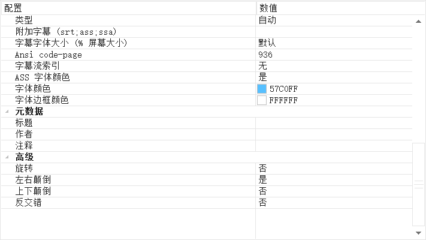
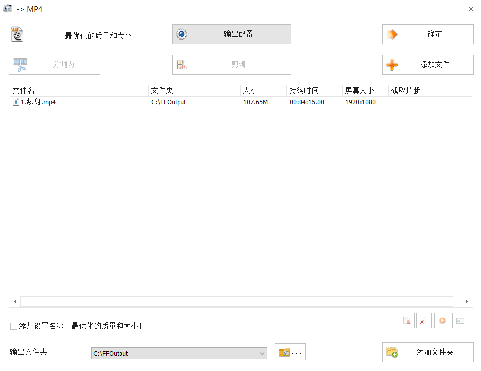

### 前言

以前是真的不会做视频，就感觉视频剪辑对我来说，很遥远。虽然一直很想学，却一直没坚持下来，起因是阿媛让我帮她将视频中的画面，进行左右反转（类似镜面原理）。

### 准备

- PC
- 格式工厂

### 进行

1. 直接选择最后需要输出的视频格式

   

2. 在输出配置中找到「高级 - 左右颠倒」，并设置一下

   

3. 导入源视频文件，最后点击开始就行。

   

### 小结

真的是非常简单，傻瓜式的操作，但还是想说一下，格式工厂这个软件，还有很多功能模块，这里就不一一细说了，如果日后用到，再次分享。

### 下载

- [格式工厂官网](http://www.pcfreetime.com/formatfactory/CN/index.html)

- [直接下载](http://down.pcgeshi.com/FormatFactory_setup.exe)

